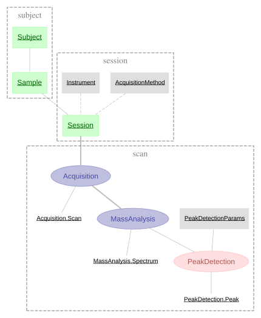

# LC-MS Demo Pipeline

A demonstration DataJoint pipeline for LC-MS (Liquid Chromatography-Mass Spectrometry) data processing.

This project showcases DataJoint 2.1 best practices with a realistic scientific workflow.

## Pipeline Overview



The pipeline models the LC-MS data analysis workflow:

1. **Subject & Sample**: Metadata about biological subjects and collected samples (plasma, liver tissue, etc.)

2. **Session**: An LC-MS instrument run, linking a sample to raw data files and acquisition parameters

3. **Acquisition**: Imports scan-level metadata from raw LC-MS files (retention time, total ion current, base peak m/z)

4. **MassAnalysis**: Extracts full mass spectral arrays (m/z and intensity vectors) for each scan

5. **PeakDetection**: Detects peaks in each spectrum using signal processing algorithms (scipy.signal.find_peaks), parameterized by `PeakDetectionParams`

Tables are named after the **process** they represent, while part tables contain the **artifacts** produced by that process:
- `Acquisition` → `Acquisition.Scan` (individual scan metadata)
- `MassAnalysis` → `MassAnalysis.Spectrum` (full m/z and intensity arrays)
- `PeakDetection` → `PeakDetection.Peak` (detected peaks with SNR)

### Parameterized Peak Detection

`PeakDetection` depends on `PeakDetectionParams`, a lookup table that defines algorithm parameters. This allows running peak detection with different settings on the same data:

| peak_params_id | height_factor | prominence_factor | min_distance | Description |
|----------------|---------------|-------------------|--------------|-------------|
| 0 | 3.0 | 2.0 | 3 | Default |
| 1 | 2.0 | 1.5 | 2 | Sensitive (more peaks) |
| 2 | 5.0 | 3.0 | 5 | Stringent (fewer peaks) |

Each `MassAnalysis` entry generates multiple `PeakDetection` results, one per parameter set.

## Installation

```bash
# Using pip
pip install lcms-demo

# From source (editable install)
pip install -e .

# With development dependencies (using uv)
uv sync --group dev
```

## Quick Start

### 1. Configure Database (DataJoint 2.1)

DataJoint 2.1 uses a layered configuration system. Non-sensitive settings go in `datajoint.json`, while credentials come from secrets or environment variables.

**Configuration sources (in priority order):**
1. Environment variables (`DJ_HOST`, `DJ_USER`, `DJ_PASS`, etc.)
2. Secrets directory (`.secrets/database.password`)
3. Config file (`datajoint.json`)

```bash
# Set password via environment variable
export DJ_PASS="your_password"

# Or use a secrets file
mkdir -p .secrets
echo "your_password" > .secrets/database.password
```

### 2. Use the Pipeline

```python
from lcms_demo.pipeline import subject, session, scan

# View tables
subject.Subject()
session.Session()
scan.Acquisition()
```

### 3. Acquire Demo Data

```python
from lcms_demo.simulation import acquire_demo_data

# Generate simple demo dataset
summary = acquire_demo_data(n_subjects=3, scans_per_session=50)
print(f"Created {summary['sessions']} sessions")
```

## Configuration

### datajoint.json

Non-sensitive settings (host, port, user) go in `datajoint.json`:

```json
{
    "database": {
        "host": "localhost",
        "port": 5432,
        "backend": "postgresql",
        "user": "datajoint"
    }
}
```

**Important:** Never store passwords in `datajoint.json`. Use environment variables or secrets files instead.

### Environment Variables

| Variable | Description |
|----------|-------------|
| `DJ_HOST` | Database hostname |
| `DJ_USER` | Database username |
| `DJ_PASS` | Database password (recommended for credentials) |

### Secrets Directory

Create `.secrets/database.password` containing just the password. Add `.secrets/` to `.gitignore`.

## Local Development with Docker

```bash
# Start local PostgreSQL
cd local && docker compose up -d

# The datajoint.json is pre-configured for local development
# Import and use
from lcms_demo.pipeline import subject, session, scan
```

## Project Structure

```
lcms-demo/
├── src/
│   └── lcms_demo/
│       ├── __init__.py       # Package initialization
│       ├── pipeline/         # Schema definitions
│       │   ├── subject.py    # Subject, Sample tables
│       │   ├── session.py    # Instrument, Method, Session tables
│       │   └── scan.py       # Acquisition, MassAnalysis, PeakDetectionParams, PeakDetection
│       └── simulation/       # Data generation utilities
├── notebooks/                # Jupyter notebooks
│   ├── 01_inspect.ipynb      # Pipeline diagram and data
│   ├── 02_acquire.ipynb      # Data acquisition
│   └── 03_query.ipynb        # Query examples
├── tests/
│   ├── unit/                 # Fast tests (no database)
│   └── integration/          # Database tests
├── scripts/
│   └── run_notebooks.py      # Execute notebooks with outputs
├── local/                    # Docker PostgreSQL setup
├── datajoint.json            # Database configuration
└── pyproject.toml            # Package configuration
```

## Simulation Options

### Generic Demo Data

```python
from lcms_demo.simulation import acquire_demo_data

summary = acquire_demo_data(
    n_subjects=5,
    samples_per_subject=2,
    scans_per_session=100,
    seed=42,
)
```

### NVS-4821 Hepatotoxicity Study

A preclinical study with treatment groups and time-course sampling:

```python
from lcms_demo.simulation import acquire_nvs4821_study

summary = acquire_nvs4821_study(
    n_scans_per_session=100,
    seed=42,
)
```

## Development

```bash
# Install with dev dependencies
uv sync --group dev

# Run unit tests (fast, no database)
pytest tests/unit/ -v

# Run all tests (requires Docker)
pytest -v

# Lint and format
ruff check src/
ruff format src/
```

## Running Notebooks

The `notebooks/` folder contains Jupyter notebooks demonstrating the pipeline.
To execute all notebooks and save outputs:

```bash
# Install notebook dependencies
pip install lcms-demo[notebooks]

# Start database
cd local && docker compose up -d && cd ..

# Execute all notebooks with saved outputs
python scripts/run_notebooks.py
```

This runs notebooks in order (01_inspect, 02_acquire, 03_query)
and saves all outputs (diagrams, tables, plots) inline.

## License

MIT License - see [LICENSE](LICENSE) for details.

## Links

- [DataJoint Documentation](https://docs.datajoint.com)
- [DataJoint Python](https://github.com/datajoint/datajoint-python)
