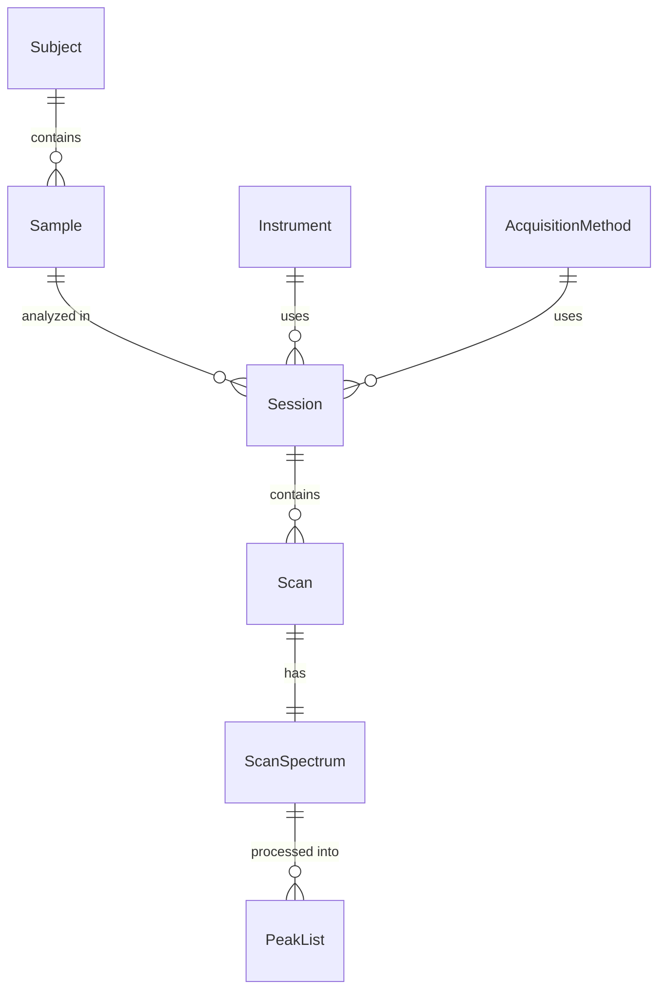

# LC-MS Demo Pipeline

A demonstration DataJoint pipeline for LC-MS (Liquid Chromatography-Mass Spectrometry) data processing.

This project showcases DataJoint best practices with a realistic scientific workflow.

## Schema Overview



## Installation

```bash
# Using pip
pip install lcms-demo

# From source (editable install)
pip install -e .

# With development dependencies (using uv)
uv sync --group dev
```

## Quick Start

### 1. Configure Database

```bash
# Copy configuration template
cp dj_local_conf.json.example dj_local_conf.json

# Edit with your database credentials
```

### 2. Use the Pipeline

```python
from lcms_demo import subject, session, scan

# View tables
subject.Subject()
session.Session()
scan.Scan()
```

### 3. Populate Demo Data

```python
from lcms_demo.simulation import populate_demo_data

# Generate simple demo dataset
summary = populate_demo_data(n_subjects=3, scans_per_session=50)
print(f"Created {summary['sessions']} sessions")
```

## Local Development with Docker

```bash
# Start local MySQL
cd local && docker compose up -d

# Configure DataJoint for local database
from lcms_demo.config import use_local_database
use_local_database()

# Import and use
from lcms_demo import subject, session, scan
```

## Project Structure

```
lcms-demo/
├── src/
│   └── lcms_demo/
│       ├── __init__.py       # Package initialization
│       ├── config.py         # Database configuration
│       ├── subject.py        # Subject, Sample tables
│       ├── session.py        # Instrument, Method, Session tables
│       ├── scan.py           # Scan, Spectrum, PeakList tables
│       └── simulation/       # Data generation utilities
├── tests/
│   ├── unit/                 # Fast tests (no database)
│   └── integration/          # Database tests
├── local/                    # Docker MySQL setup
├── pyproject.toml            # Package configuration
└── dj_local_conf.json.example
```

## Simulation Options

### Generic Demo Data

```python
from lcms_demo.simulation import populate_demo_data

summary = populate_demo_data(
    n_subjects=5,
    samples_per_subject=2,
    scans_per_session=100,
    seed=42,
)
```

### NVS-4821 Hepatotoxicity Study

A preclinical study with treatment groups and time-course sampling:

```python
from lcms_demo.simulation import populate_nvs4821_study

summary = populate_nvs4821_study(
    n_scans_per_session=100,
    seed=42,
)
```

## Development

```bash
# Install with dev dependencies
uv sync --group dev

# Run unit tests (fast, no database)
pytest tests/unit/ -v

# Run all tests (requires Docker)
pytest -v

# Lint and format
ruff check src/
ruff format src/
```

## License

MIT License - see [LICENSE](LICENSE) for details.

## Links

- [DataJoint Documentation](https://docs.datajoint.com)
- [DataJoint Python](https://github.com/datajoint/datajoint-python)
